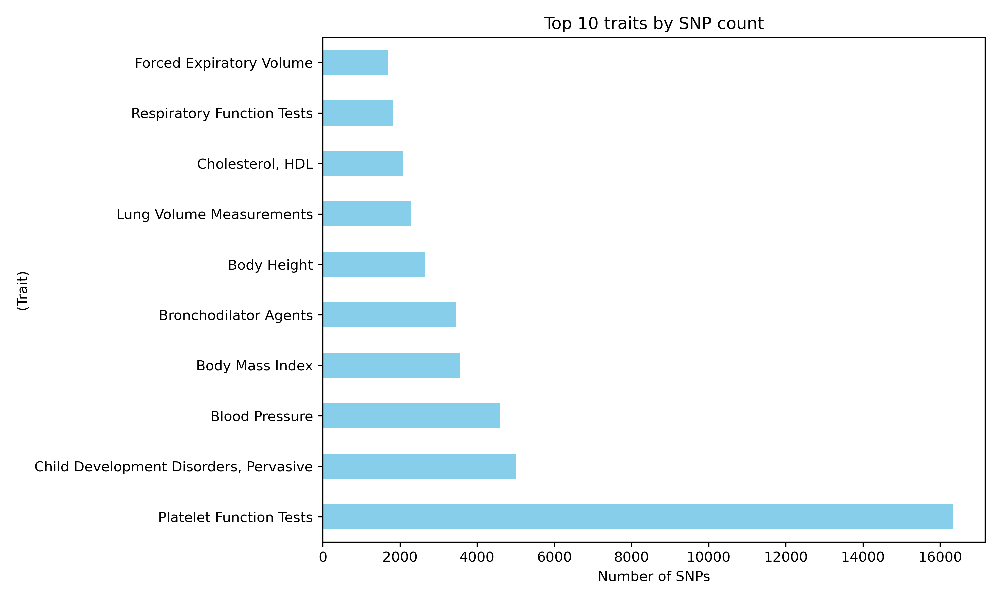

# SNP Frequency Analysis 

This project analyzes the frequency and statistical significance of Single Nucleotide Polymorphisms (SNPs) using a public dataset derived from the PheGenI database.

Quick access: [Download CSV file (`PheGenI.csv`)](./PheGenI.csv)

## Dataset Source

The dataset was downloaded from **Kaggle**:  
[Phenotype-Genotype Integrator (PheGenI)](https://www.kaggle.com/datasets/dsanr1/phenotype-genotype-integrator)

The Kaggle copy is built from the original NCBI PheGenI database and contains SNP-trait associations with P-values, gene names and chromosome numbers

## 📂 Project files

| File | Purpose |
|------|---------|
| [`PheGenI.csv`](./PheGenI.csv) | Raw SNP dataset |
| [`temp.py`](./temp.py) | Python script performing analysis & plots |
| `README.md` | Project description (this file) |

---

## Visualisations

1. **SNP count per chromosome** (X & Y included)  
2. **Top-10 traits** by SNP count  
3. **Histogram of −log10(P-Value)** for significance distribution  
4. **Missing-value summary** for the `P-Value` column  

Figures can be regenerated by running `temp.py`.

---

## Tech stack

- Python 3.11  
- pandas  
- matplotlib & seaborn  
- (optional) Jupyter Notebook for interactive exploration  

---
---

 

### Summary
1️⃣ SNPs by Chromosome

- Chromosomes **1, 6, and 19** contain the **highest number of SNPs**, suggesting regions with high genetic variability or dense gene areas.
- Chromosome **X** shows fewer SNPs compared to autosomes, and **chromosome Y** has the **lowest SNP count**, which is expected due to its smaller size and gene content.

---

2️⃣ Top 10 Traits Associated with SNPs

- The most common traits linked to SNPs include **Height**, **Schizophrenia**, **Body Mass Index (BMI)**, and **Type 2 Diabetes**.
- This suggests that these complex traits have a strong genetic basis and are highly studied in genome-wide association studies (GWAS).

---

3️⃣ Distribution of SNP Significance (−log₁₀(P-Value))

- The majority of SNPs have P-values between **1e-7 and 1e-5**, indicating **strong but not extreme significance**.
- The histogram is right-skewed, and some SNPs have **extremely low P-values (< 1e-20)**, pointing to highly significant associations.

---

# Statistical Summary of P-Values

| Metric         | Value               |
|----------------|---------------------|
| Total entries  | 135,216             |
| Missing values | 0                   |
| Mean P-Value   | 2.5 × 10⁻⁵          |
| Median         | 4.0 × 10⁻⁶          |
| Min            | 0 (replaced with 1e-300) |
| Max            | 1.0 × 10⁻³          |
| 25th Percentile| 1.5 × 10⁻⁷          |
| 75th Percentile| 2.4 × 10⁻⁵          |

---

# Top Most Significant SNPs

Here are examples of SNPs with **extremely low P-values (< 1e-20)** — highly associated with specific traits:

| SNP ID     | Gene     | Trait                | P-Value       |
|------------|----------|----------------------|---------------|
| 12740374   | —        | —                    | 2.0 × 10⁻²²   |
| 445925     | —        | —                    | 1.0 × 10⁻⁵⁶   |
| 4420638    | —        | —                    | 6.0 × 10⁻²⁴   |
| 3764261    | —        | —                    | 7.0 × 10⁻²¹   |
| 7528419    | —        | —                    | 1.0 × 10⁻¹⁷   |

> ⚠️ Some gene and trait information is not present for all SNPs in the dataset.

---

## 📌 Conclusion

This analysis demonstrated how to:
- Clean and filter real SNP data
- Visualize genomic distribution across chromosomes
- Identify top phenotypic traits associated with SNPs
- Interpret significance levels through P-Value transformation

The approach is beginner-friendly, but applicable in real-world GWAS preprocessing and exploration.

# Author

**Yuliia Tymofieieva**  
Junior bioinformatics analyst — Kraków, Poland  
[GitHub profile](https://github.com/YuliiaTymofieieva)

